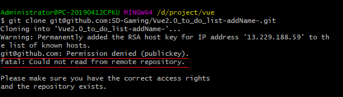
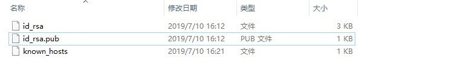
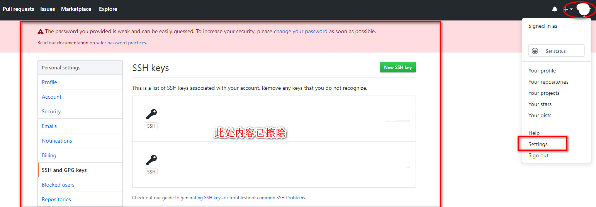
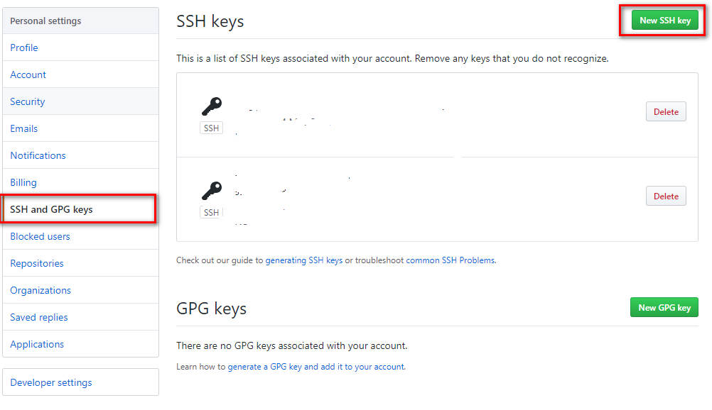
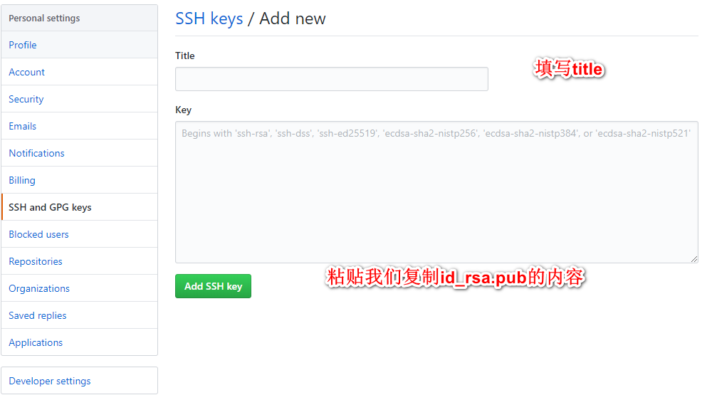

#### 新手安装git之后如何clone我们在github上看到的项目

之前在公司安装了git，由于临时换了电脑重新安装git，突然发现git clone url报错

- 权限被拒绝(publickey)
- 无法从远程库读取

所以思考是不是没有创建SSH Key。接着我就按照网上的方式找到了用户目录下的.ssh的文件夹，发现里面
没有`id_rsa`和`id_rsa.pub`这两个文件；
既然没有这个文件，我自然是需要创建的
- 首先,在打开git bash 并且输入`ssh-keygen -t rsa -C "youremail@example.com"`
- 这里的`youremail@example.com`指的是我们自己的邮箱
- 然后我们会发现c盘（我的是c盘）administrator下生成了.ssh文件夹，并且里面对应有`id_rsa`和`id_rsa.pub`两个文件，如下图：

- 将`id_rsa.pub`用记事本打开并且复制内容到剪切板
- 登录github账号，点击右上角小图标下拉setting

- 跳转页面之后点击左侧`SSH and GPG keys`

- 点击`New SSH key`按钮，然后填上自己命名的Title

- key下面的文本域就给我们之前复制的内容粘贴到里面，然后`Add SSH key`就完成了